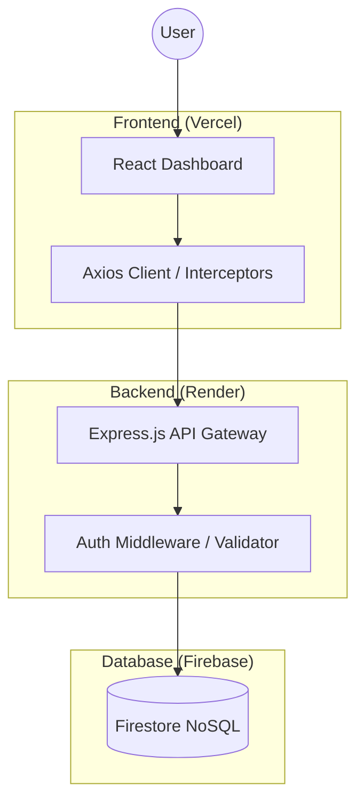

# 🕒 Attendance Hub | Ultimate Management System

[](https://mini-attendance-orcin.vercel.app)
[](https://mini-attendance-dig9.onrender.com/api/v1/health)
[](https://opensource.org/licenses/MIT)
[](#)

A flagship, production-ready full-stack application featuring real-time attendance tracking and task management. Engineered with a premium **Glassmorphism UI**, secured with **JWT Authentication**, and powered by a highly resilient **Firebase Firestore** backend.

---

## 🚀 Live Demo
Experience the professional workflow instantly:
*   **Web Portal**: [https://mini-attendance-orcin.vercel.app](https://mini-attendance-orcin.vercel.app)
*   **API Gateway**: [https://mini-attendance-dig9.onrender.com/api/v1](https://mini-attendance-dig9.onrender.com/api/v1)

---

## ✨ Key Features

### 🏢 Attendance Excellence
*   **Real-time Clock-In/Out**: Precision tracking of working hours with session persistence.
*   **Today's Logs**: Dynamic visual history of all attendance sessions for the current day.
*   **Automatic Overlap Prevention**: Intelligent guards prevent duplicate or overlapping check-ins.
*   **Status Indicators**: Live "Currently Working" or "Off-Duty" status synced with your profile.

### 📋 Smart Task Management
*   **Attendance-Locked Productivity**: Tasks can only be managed (created/deleted/completed) while you are clocked in, ensuring disciplined workflows.
*   **Full CRUD**: Blazing-fast task creation, completion toggles, and secure deletions.
*   **Real-time Updates**: Instant state synchronization across your dashboard.

### 🛡️ Enterprise Security
*   **JWT-Based Auth**: Secure token management stored locally for a seamless login experience.
*   **Password Hashing**: Industry-standard encryption using `bcryptjs`.
*   **Data Isolation**: Strict Firestore rules and server-side filtering ensure users only see their own private data.
*   **Input Validation**: Comprehensive sanitization using `express-validator`.

---

## 🛠️ Tech Stack

### Backend Infrastructure
*   **Runtime**: Node.js & Express.js
*   **Database**: Firebase Firestore (NoSQL)
*   **Auth**: JSON Web Tokens (JWT) & bcryptjs
*   **Tooling**: Morgan (Logging), Dotenv (Env Management), Nodemon

### Frontend Experience
*   **Framework**: React.js (Vite)
*   **Styling**: Vanilla CSS (Custom Glassmorphism Design System)
*   **Interaction**: Axios, SweetAlert2 (Premium Notifications)

---

## 🏗️ Technical Architecture



---

## 📂 Folder Structure

```text
Attendance/
├── backend/
│   ├── src/
│   │   ├── config/         # Firebase Admin SDK Configuration
│   │   ├── controllers/    # Business Logic (Auth, Attendance, Task)
│   │   ├── middleware/     # JWT Auth & Error Handling
│   │   ├── routes/         # Express API Route Definitions
│   │   └── app.js          # Main App Config & Middlewares
│   ├── .env                # Server Secrets (Ignored)
│   └── server.js           # Production Entry Point
├── frontend/
│   ├── src/
│   │   ├── api/            # API Client + Token Interceptors
│   │   ├── pages/          # Premium UI Views (Login, Dashboard, 404)
│   │   ├── App.jsx         # Routing & Protection Logic
│   │   └── main.jsx        # Client Runtime Entry
│   └── .env                # App Config (Ignored)
└── README.md               # Master Documentation
```

---

## 📊 Database Schema (Firestore)

| Collection | Description | Primary Fields |
| :--- | :--- | :--- |
| **users** | Member Profiles | `email`, `name`, `password` (hashed) |
| **attendance** | Daily Records | `userEmail`, `date`, `checkIns` (array) |
| **tasks** | Work Items | `userId`, `title`, `description`, `status` |

---

## 🛣️ API Documentation

All routes are prefixed with `/api/v1`.

### 🔐 Authentication
| Action | Endpoint | Method |
| :--- | :--- | :--- |
| Register | `/auth/register` | `POST` |
| Login | `/auth/login` | `POST` |

### ⌚ Attendance (JWT Protected)
| Action | Endpoint | Method |
| :--- | :--- | :--- |
| Clock In | `/attendance/checkin` | `POST` |
| Clock Out | `/attendance/checkout` | `POST` |
| Fetch Logs | `/attendance/my` | `GET` |

### 📝 Tasks (JWT Protected)
| Action | Endpoint | Method |
| :--- | :--- | :--- |
| List Tasks | `/tasks` | `GET` |
| Create Task | `/tasks` | `POST` |
| Update/Toggle | `/tasks/:id` | `PUT` |
| Remove Task | `/tasks/:id` | `DELETE` |

---

## ⚙️ Setup & Installation

### 1️⃣ Repository Setup
```bash
git clone https://github.com/suborazz/mini-attendance.git
cd mini-attendance
```

### 2️⃣ Backend Configuration
```bash
cd backend
npm install
```
Create a `.env` file with these keys:
```env
PORT=5000
JWT_SECRET=your_jwt_secret_key
FIREBASE_PROJECT_ID=your_id
FIREBASE_CLIENT_EMAIL=your_email
FIREBASE_PRIVATE_KEY="your_private_key"
```
Run Server: `npm run dev`

### 3️⃣ Frontend Configuration
```bash
cd ../frontend
npm install
```
Create a `.env` file:
```env
VITE_API_URL=http://localhost:5000/api/v1
```
Run Client: `npm run dev`

---

## 🚀 Deployment Guide

### 🧱 Render (Backend)
1. **Web Service**: Create one and connect your repo.
2. **Build**: `npm install` (Root: `backend`).
3. **Start**: `node server.js`.
4. **Secrets**: Add all `.env` keys in the Render dashboard.

### 🌐 Vercel (Frontend)
1. **Connect**: Point Vercel to the repo.
2. **Root**: Select `frontend` as the root directory.
3. **Build**: `npm run build` (Output: `dist`).
4. **Secrets**: Add `VITE_API_URL` pointing to your Render backend gateway.

---

## ⚖️ License
Distributed under the MIT License. See `LICENSE` for more information.

---

Developed with ❤️ by [Subod](https://github.com/suborazz)
